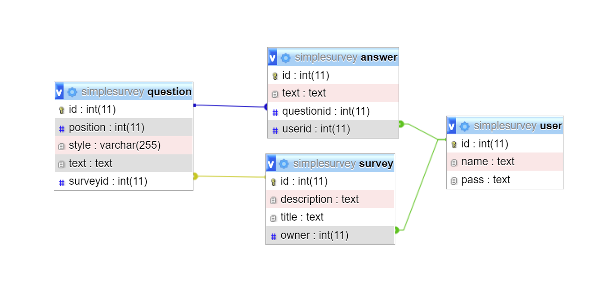

**Table of Contents**

- [1. Introduction](#1-introduction)
  * [1.1 Purpose](#11-purpose)
  * [1.2 Scope](#12-scope)
  * [1.3 Definitions, Acronyms, and Abbreviations](#13-definitions--acronyms--and-abbreviations)
  * [1.4 References](#14-references)
  * [1.5 Overview](#15-overview)
- [2. Architectural Representation](#2-architectural-representation)
- [3. Architectural Goals and Constraints](#3-architectural-goals-and-constraints)
- [4. Use-Case View](#4-use-case-view)
  * [4.1 Use-Case Realizations](#41-use-case-realizations)
- [5. Logical View](#5-logical-view)
  * [5.1 Overview](#51-overview)
  * [5.2 Architecturally Significant Design Packages](#52-architecturally-significant-design-packages)
- [6. Process View](#6-process-view)
- [7. Deployment View](#7-deployment-view)
- [8. Implementation View](#8-implementation-view)
  * [8.1 Overview](#81-overview)
  * [8.2 Layers](#82-layers)
- [9. Data View](#9-data-view)
- [10. Size and Performance](#10-size-and-performance)
- [11. Quality](#11-quality)

# 1. Introduction

The introduction of the **Software Architecture Document** provides an overview of the entire **Software Architecture Document**. It includes the purpose, scope, definitions, acronyms, abbreviations, references, and overview of the **Software Architecture Document**.

## 1.1 Purpose

This document provides a comprehensive architectural overview of the system, using a number of different architectural views to depict different aspects of the system. It is intended to capture and convey the significant architectural decisions which have been made on the system.

## 1.2 Scope

This document describes the way we write code and how we connect the components of the project.

## 1.3 Definitions, Acronyms, and Abbreviations

| Abbrevation | Description                            |
| ----------- | -------------------------------------- |
| n/a         | not applicable                         |

## 1.4 References

[Blog](https://simplesurveyproject.wordpress.com/)  
[GitHub Repository](https://github.com/SimpleSurveyProject)  
[MVC Diagram](https://github.com/SimpleSurveyProject/SimpleSurvey-Documentation/blob/main/ressources/MVC.png)  
[Use Case Diagram](https://screen.simonlabs.de/img.php?id=2I0cisf)  
[Fill out survey Use Case](https://github.com/SimpleSurveyProject/SimpleSurvey-Documentation/blob/main/use-cases/use-case-fillsOutSurvey.md)  
[Share survey Use Case](https://github.com/SimpleSurveyProject/SimpleSurvey-Documentation/blob/main/use-cases/use-case-sharesSurvey.md)  
[Create survey Use Case](https://github.com/SimpleSurveyProject/SimpleSurvey-Documentation/blob/main/use-cases/use-case-createSurvey.md)  
[Edit survey Use Case](https://github.com/SimpleSurveyProject/SimpleSurvey-Documentation/blob/main/use-cases/use-case-editSurvey.md)  
[Evaluate survey Use Case](https://github.com/SimpleSurveyProject/SimpleSurvey-Documentation/blob/main/use-cases/use-case-evaluateSurvey.md)  
[Architecture](ressources/architecture.png)  
[Deployment](https://screen.simonlabs.de/img.php?id=2HVXfjn)  
[Database model](ressources/dbmodel.png)  

## 1.5 Overview

This document contains the architectural representation, goals and constraints as well as the logical, deployment, implementation and data views.

# 2. Architectural Representation

- [5. Logical View](#5-logical-view)
- [6. Process View](#6-process-view)
- [7. Deployment View](#7-deployment-view)
- [8. Implementation View](#8-implementation-view)
- [9. Data View](#9-data-view)

# 3. Architectural Goals and Constraints

For the **frontend** we will use Angular. Angular is a JavaScript framework which was developed by Google. It aims at the development of web applications and attaches great importance to structure and quality. It was the first framework which was also suitable for large enterprise applications due to its focus on architecture, testing and isolated components in the JavaScript area.
Our **backend** is realized with Spring Boot. Spring Boot is a Java framework that aims to simplify programming with Java by avoiding repetitive code and encouraging good programming practices. With Spring Security we will implement authentication and login, with Spring Data we will connect to the database.

# 4. Use-Case View

## 4.1 Use-Case Realizations

Our  use cases can be found here:  
https://github.com/SimpleSurveyProject/SimpleSurvey-Documentation/tree/main/use-cases

# 5. Logical View

## 5.1 Overview

We are implementing according to the MVC pattern:
The logical view for our application follows the Spring Boot architecture and contains the controller and the model. The frontend contains only the view and services which connect to the backend.

## 5.2 Architecturally Significant Design Packages

BLUE = MODEL  
ORANGE = CONTROLLER

# 6. Process View

n/a

# 7. Deployment View

# 8. Implementation View

n/a

## 8.1 Overview

n/a

## 8.2 Layers

n/a

# 9. Data View

# 10. Size and Performance

n/a

# 11. Quality

n/a
