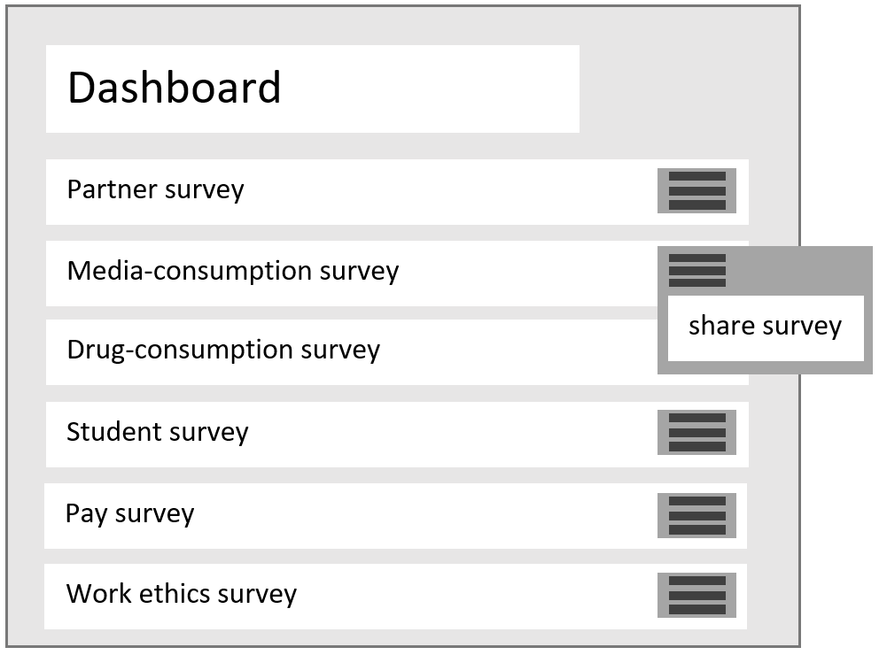

# Use-Case: User shares survey

## Brief Description

A user shares a survey, which he has already created.

## Screenshot

# Flow of Events

## Basic Flow

- User clicks on the share button
- User selects share option from the share menu
- The user gets the link created by the backend

## Activity Diagram

If you want to take a look at our activity diagram then check out this link: [CLICK HERE](http://shorturl.at/dtxyQ)

## Cucumber

Check your Cucumber-Test-Case here: [CLICK HERE](https://github.com/SimpleSurveyProject/SimpleSurvey-Cucumber/blob/main/Share_survey.feature)

## Alternative Flows

n/a

# Special Requirements

n/a

# Preconditions

 - The survey must have been created by the user.
 - Sufficient user rights must be available (e.g. the user has to be logged in).

# Postconditions

n/a

# Extension Points

n/a
